## 포장상태 3D 조사장비

### 개요

도로포장상태 조사장비는 도로 주행중인 운전자의 승차감을 좌우하는 주요 요인인 도로 평탄성을 측정하는 장비이다.

전문 인력을 투입하여 수일에 거쳐 조사했었던 기존 방식과 달리 차량들의 교통흐름을 방해하지 않고 차량에 장착된 여러가지 장비들을 이용하여 도로 평탄성과 관련된 다양한 데이터를 취득할 수 있다.

  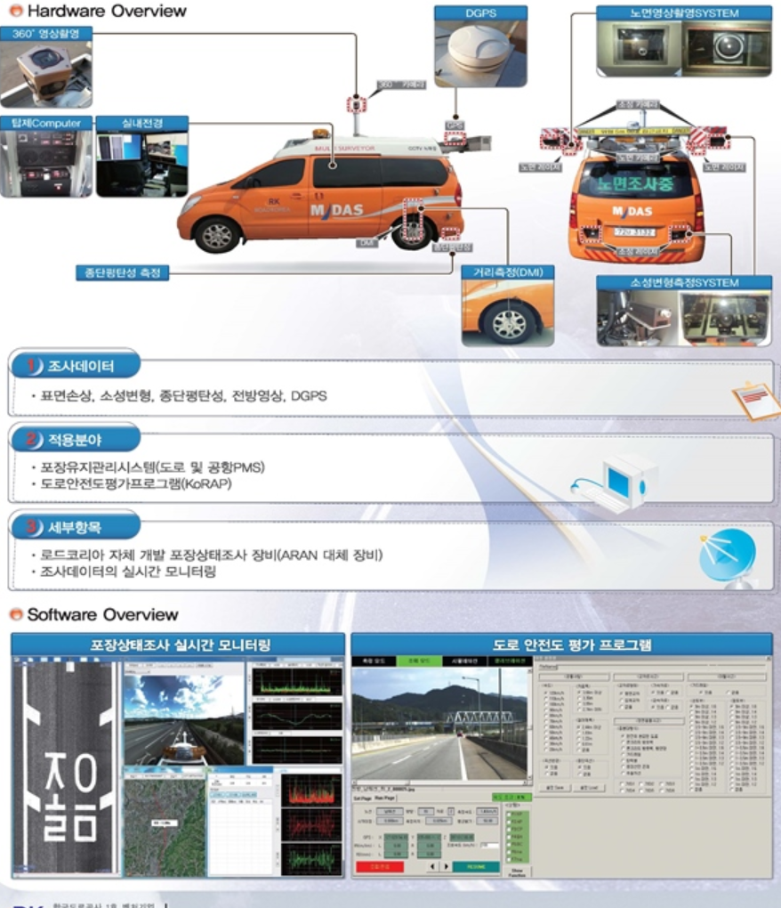  

조사 차량의 뒷편에는 주행중인 도로 노면을 촬영하는 두대의 라인 스켄 카메라가, 차량 상부에는 도로 주변을 전방위로 촬영하는 360도 카메라가, 챠랑 하단에는 주행 방향의 도로 높낮이를 측정하는 종방향 평탄성 장비가 장착되어 있다. 또한 조사중인 도로 위치 데이터를 취득하기 위해 차량 내부에 GPS 장치가 장착되어 있다.

여러 장비에서 취득된 데이터는 차량 내부에 장착된 PC의 모니터 화면에 수치와 그래프, 영상 등 다양한 방식으로 실시간으로 디스플레이 되며, 이를 통해 차량에 탑승한 조사자가 현재 주행중인 대상 도로의 정보를 다양한 방법으로 확인 가능하다. 

특이사항으로는 로드코리아, 도로교통연구원, 한국공항공사에서 발주한 프로젝트들을 병행하여 진행했었는데, 이는 각 프로젝트에서 요구되는 기본적인 사항들이 동일하였기 때문에 가능했었다.

또한 기본적인 어플리케이션의 구조 및 동작 프로세스는 구현되어 있는 상황이었기 때문에 내부 구조 개선을 통한 어플리케이션 안정화와 각 프로젝트에서 발주처가 요구사항에 따른 추가 모듈 개발 및 연동 등의 유지보수 업무 위주로 진행하였다.

### 세부사항

* 기간 : 2015.01 ~ 2016.03.25
* 사용언어 : C++(MFC)
* 사용 라이브러리 : exiv2, RTCore(사내 개발용  라이브러리), STL, MFC 기본 컨트롤, RTCore(t사내 개발 공용 라이브러리)

#### 담당 파트

##### **조사 데이터 후처리 프로세스 개선(공통)**

사용자가 조사 종료시 후처리 프로세스중 조사 중에 저장된 도로 현황 이미지와 GPS 정보를 이용하여 이미지 헤더에 GPS 삽입하는 기능을 구현하였다.

이는 원본 이미지 복사본 생성 과정에서 이미지 헤더에 GPS 정보를 포함시켰던 기존의 방식이 이미지 장수에 따라 처리 시간이 선형적으로 증가하는 문제를 개선하기 위함이었다.(만장 처리시 80여초 소요) 

기능 구현시 이미지 메타 데이터 라이브러리인 exiv2를 사용하였다.

개선된 기능 적용시 동일한 장수 처리 시간은 약 6초정도로 기존 대비 약 13배 빨라진 효과가 있었다.

##### **교량접속부 측정 장비 제어 모듈 개발(도로교통연구원)**

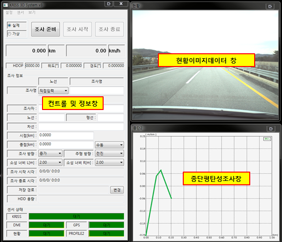  

교량접속부 측정을 위해 자체 제작한 장비 제어 및 데어트 수신을 위한 통신 프로토콜 설계 및 구현하였다.

특이사항으로는 교량접속부 측정값을 산출하기 위해 장비에 장착된 두 종류의 센서의 데이터를 취합하여 사용했다..

각 센서들 동시에 데이터를 수신하고, 동일한 타이밍에 수신된 데이터를 얻기 위해 쓰레드와 Event 핸들 오브젝트를 사용하여 처리하였다.

##### **활주로 조사 보조 디스플레이 인터페이스 개발(한국공항공사)**

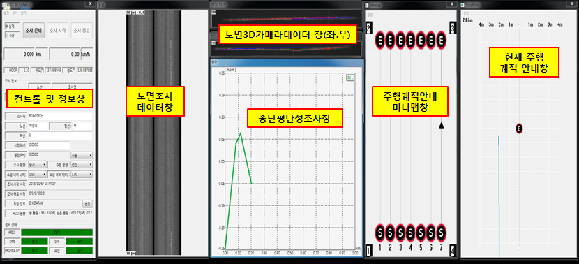  

활주로 폭은 8미터로 일반도로에 비해 약 3배정도 넓어 일반도로처럼 한번에 조사 장비를 이용하여 측정하기 어려운 문제가 있었다.

따라서 효율적으로 활주로를 조사할 수 있는 인터페이스에 대한 요구가 있었다.

이에 조사구간에 대한 현황파악이 가능한 궤적안내 미니맵과 조사중 현재 이동중인 위치를 궤적으로 표시해주는 주행궤적 디스플레이 인터페이스를을 설계, 구현하였다.

궤적 안내 미니맵은 조사할 활주로의 각 코너 GPS 좌표와 조사 간격을 입력하면, 화면에 조사햐애할 횟수를 시각적으로 확인할 수 있도록 구현하였다. 

또한 사용자에게 이미 조사한 구간과 남은 구간의 구분을 명확하게 인지시키기 위해 조사를 마친 구간은 회색으로 표시되도록 구현하였다.

주행궤적 디스플레이는 현재 조사할 구간의 시, 종점의 GPS 좌표 데이터를 이용하여 아이콘으로 표시되고, GPS센서로부터 현재 차량의 좌표값을 수신하여 화면상에 이동 궤적이 표시되록 구현하였다.

이는 항공기를 기준으로 차선이 그려진 활주로에서 조사차량으로는 일반도로에서처럼 시작부터 끝까지 벗어남 없이 주행할 수 있도록  보조해주기 위해 고안한 인터페이스였다.

또한  운전자 단독으로 조사 장비를 운용할 상화도 고려하여 청각 정보를 이용한 인터페이스도 구현하였다.

주행중인 차량인 차량이 종점위치 통과시 종료되는 자동 종료 기능과 시종점의 GPS 좌표 데이터로 가상의 궤적데이터를 생성하여 현재 주행위치가 궤적데이터의 x좌표에서 멀어지는 거리에 따라 차량에 장착된 스피커를 통해 알람음의 빠르기를 달리하여 재생되도록 하였다.

따라서 운전자는 모니터 화면을 보고 조작할 필요없이 소리에 의지하여 조사할 수 있었다.

### 어려웠던 점

#### **커스텀 UI 컨트롤 개발의 어려움**

활주로 조사 보조 디스플레이 인터페이스의 경우 새로운 컨셉의 UI 컨트롤이었기 때문에 속성 육안 조사기 개발 프로젝트 때처럼 상용UI 라이브러리 컨트롤을 이용하여 개발할 수가 없었다.

따라서 전부 새로 구현했어야 했는데, 이러한 방식으로 UI 컨트롤 개발은 처음 진행하다보니 어려운 점이 많았다.

그러다보니 기획단계에서 구상했던 기능적인 부분은 대부분 다 반영이 되었으나, 외관적인 부분은 생각했던 것보다 투박하게 구현되어 많이 아쉬웠다.

#### **추가 개발한 모듈과 다른 개발자가 만든 어플리케이션에간의 연동에 따른 어려움**

어플리케이션 내에 다른 모듈들 처럼 신규 개발한 모듈들 또한 실행되어야 했기 떄문에 기존 프로그램의 안정성과 모듈 연동 두마리 토끼를 둘다 잡아야 하는 상황이었다.

신규 개발한 모듈 연동시 발생할 사이드 이펙트를 최소화 하기 위해 다른 모듈들이 어플리케이션과 어떻게 연동되어 있는지 코드분석부터 했었다. 

어플리케이션 내에 여러 모듈들이 통합되어 실행되는 구조였기 때문에 기존 수행했던 프로젝트들에 비해 코드의 양이 상당히 많아 연동 부분 작업보다 코드 분석에 시간이 많이 걸렸었다.

그나마 한가지 다행이었던 것은, 작성된 코드가 입사 당시부터 레퍼런스로 삼아 공부했었던 개발자의 코드였기 떄문에 모듈 구조나 코딩 스타일이 눈에 익어 전체적인 흐름을 파악하는데는 크게 문제가 없었다는 점이다.

### 정리

기존 프로젝트보다 작성된 코드의 양은 물론 실행 복잡도가 높아 분석뿐만 아니라 개발에 많은 어려움이 있었다. 하지만 프로젝트를 수행하는 과정에서 각 모듈 및 어플리케이션의 구조를 이해하고, 동작을 파악하는 과정을 통해 코드 분석 및 개발 역량 수준을 프로젝트 수행 전보다 많이 높일 수 있었다.

또한 UI 컨트롤 개발을 하면서 기획부터 설계, 개발까지 전체 프로세스를 경험했었기 때문에 UI 컨트롤 개발 역량 또한 한층 더 키울 수 있었다. 

### 스크린샷

* 포장상태 조사장비 운용 어플리케이션 실행화면
 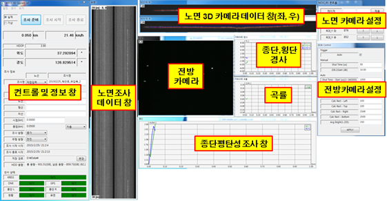  

## 속성육안조사기

### 개요

전국 도로의 안전 점검 업무를 담당하고 있는 한국건설기술연구원에서 의뢰로, 주행중인 차량에서 조수석에 앉은 선탑자가 현재 도로의 현황 및 주변 시설물에 대한 컨텐츠를 신속하게 기록할 수 있는 장비 및 운용 어플리케이션 개발 프로젝트였다.

기록 장비는 시리얼 타입의 키입력 방식의 인터페이스 디바이스를 제작하여 납품하였다.

이는 조작 가능한 디바이스 중 가장 친숙한 인터페이스의 장비로 사용자가 별다른 어려움 없이 바로 사용이 가능할 수 있기 때문이었다.

물론 발주처에서는 이런 목적에 부합하는 장비 및 소프트웨어를 운용하고 있었으나, 사용중인 장비가 여러가지 이유로 현재 상황에 활용이 어려워 신규 개발 건으로 진행하였다.

### 세부내용

- 기간: 14.05.28 ~ 15.01.09
- 사용언어 : C++(MFC)
- 사용라이브러리 : RTCore(사내 개발용  라이브러리), STL, CodeJock ToolkitPro, MFC 기본 컨트롤, MFC GridCtrl, RTCore(t사내 개발 공용 라이브러리)

#### 담당파트

##### **커스터마이징이 가능한 키 매핑 인터페이스 설계 및 개발**

기존의 장비와 함께 사용중인 어플리케이션의 경우 설정된 키의 동작 방법을 변경 할 수 있는 인터페이스가 제공되지 않았었다.

따라서 조사 환경이 바뀌어 입력해야 될 항목들이 바뀌는 경우에는 해당 장비 및 어플리케이션을 활용할 수 없다는 문제가 있었다.

이러한 문제를 해결하기 위해 조사 환경에 따라 사용자가 각 키들의 동작 설정을 커스터마이징 매핑이 가능한 설계 및 개발 하였다.

매핑 UI 인터페이스는 MFC 그리드 오픈 소스인 MFCGridCtrl 를 커스터마이징 하여 개발하였다.

매핑된 키 데이터 설정 데이터는 TinyXML 라이브러리를 사용하여 XML 파일로 관리하였다.

또한 매핑 UI 인터페이스를 이용하여 사용자가 원하는 대로 키배치를 하여 사용할 수 있었기 때문에 사용자 편의성도 높일 수 있었다.

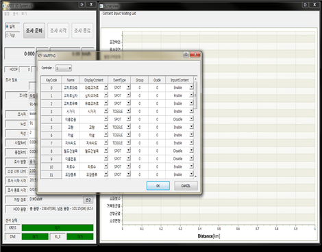  

##### **입력 컨텐츠 디스플레이 컨트롤 개발**

기존 어플리케이션의 경우 사용자가 입력한 컨텐츠들을 가로바 형태를 그래프로 디스플레이 되는 커스텀 컨트롤을 사용하였다.

그런데 화면상에 각 컨텐츠들이 단책이나 해치(Hatch)  스타일로 디스플레이가 되었기 대문에, 여러 컨텐츠가 있는 화면의 경우 한눈에 구분하기 어렵다는 문제가 있었다.

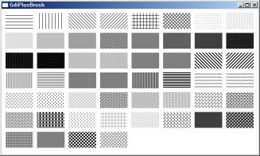

신규 개발한 컨텐츠 디스플레이 컨트롤에서는 각 컨텐츠별로 명확하게 구분이 되도록 각각 색깔을 설정할 수 있는 인터페이스를 구현하였다.

디스플레이 컨트롤 개발시 Codejock UI 라이브러리의 차트 컨트롤을 커스터마이징 하여 사용하였다.

이는 회사에서 구매하여 사용중인 유일한 UI 라이브러리라는 이유도 있었지만, 차트 출력에 데이터 삽입 및 삭제 등의 기본적인 처리 및 화면 출력 등 디스플레이에 필요한 기본적인 기능들이 이미 구현되어 있었기 때문에 "바퀴를 새로 발명할 것 없이"  필요한 기능 개발로 바로 들어갈 수 있었기 때문이었다.

##### **시리얼 인터페이스 키보드 디바이스 제어 모듈 개발**

어플리케이션에서 디바이스와 시리얼 통신로 제어하는 부분은 기존에 개발된 다른 프로젝트의 시리얼 통신 모듈을 활용하여 해당 프로젝트에서 디바이스와 어플리케이션간 데이터 통신 프로토콜 처리 부분 등 필요한 기능들만 추가로 개발하였다.

### 어려웠던점

#### 키매핑 인터페이스의 높은 자유도로 인한 개발의 어려움

발주처의 요구사항에 따라 상황에 따라 커스터마이징이 가능한 입력 인터페이스로 여러가지 고려해야될 사항들이 많아 설계 및 구현에 많은 어려움이 있었다.

예를 들자면,  "Caps Lock" 같은 토글키처럼 ON/OFF 에 따라 다르게 동작하는 기능이라던가 동일한 그룹으로 설정된 키들끼리 연동하여 동작되도록 설정 가능한 그룹핑(Grouping) 기능 등 키 매핑에 필요한 여러가지 설정들을 조합하여 다양하게 동작 시킬 수 있었다.

이렇게 설정된 키들이 사용자의 키입력에 따라 다양한 상황이 연출될 수 있었기 때문에 이를 고려한 동작 시나리오를 작성하는 것도 일이었다.

하지만 이렇게 작성된 동작 시나리오는 내부 검증시 테스트 시나리오로 활용되어 어플리케이션 안정화에 많은 도움이 되었었다. 

### 정리

해당 프로젝트를 수행하며 요구사항을 분석하여 UI 인터페이스를 설계하고 구현 경험을 쌓을 수 있었으며, 기존의 UI 컨트롤을 이용하여 커스터마이징된 새로운 UI 컨트롤을 개발 경험을 쌓을 수 있었다.

이를 통해 UI 개발 역량을 키울 수 있었음은, 물론 UI 컨트롤 개발에 대한 자신감도 생겼었다.  

### 스크린샷

* 제어프로그램 실행화면

    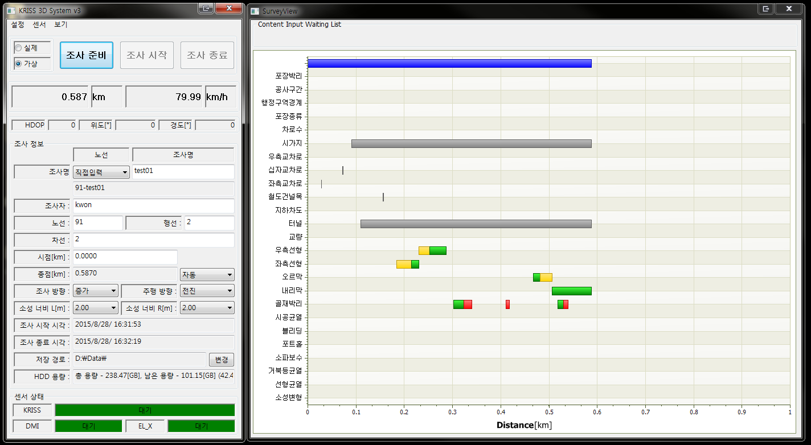  

* 키 매핑 설정화면(MFC Ctrl Library)

    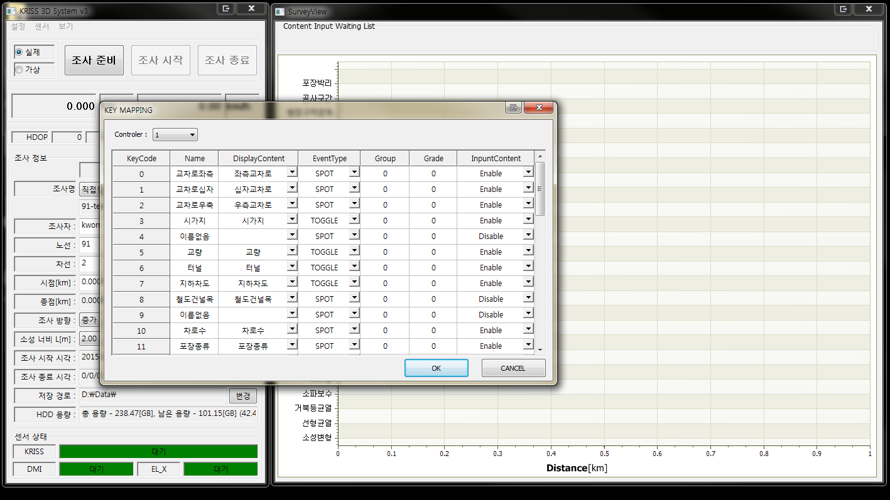  

## 도로평탄성조사기

### 개요

한국건설품질시험원 의뢰로 Supro社의 2륜형 도로평탄성 측정 장비인 Surpor4000 을 레퍼런스로 한 장비 제작 및 운용 어플리케이션 개발 프로젝트였다.

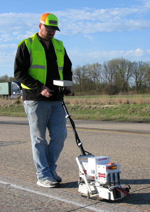

Surpro의 경우 손잡이 상단에 부착된 LCD 디스플레이와 물리 버튼으로 구성된 컨트롤 패널로 장비 조작이 가능했다.

하지만 프로젝트에서 제작된 장비의 컨트롤 패널로 윈도우 타블렛을 채택하였다.

이는 데스크탑의 윈도우 환경에서 개발한 어플리케이션을 그대로 사용할 수 있음은 물론 발주처의 요청에 따라 화면 배치 및 기능 추가 등을 자유롭게 할 수 있기 때문이었다.

### 세부내용

- 기간: 13.12.02 ~ 14.05.23
- 사용언어 : C++(MFC)
- 사용라이브러리 : RTCore(사내 개발용  라이브러리), STL, GDI+, MFC 기본 컨트롤, RTCore(t사내 개발 공용 라이브러리)

#### 담당파트

##### **UI 인터페이스 설계 및 구성**

UI 설계시 조사중인 장비로부터 취득되는 데이터를 수치 정보로 디스플레이 하는 부분 외에 순간순간의 데이터를 시각적으로 보여주는 그래프 컨트롤을 추가로 배치하기로 하였다.

이는 조사중인 도로의 평탄성 경향을 시각적으로 파악이 가능하게 하여 사용자의 편의성을 높이려는 의도였다.

그런데 컨트롤 패널로 채택한 윈도우 타블렛 사이즈가 7인치였기 때문에 화면에 모든 인터페이스를 배치하기엔 사이즈 제한이 있었다.

따라서 화면을 두페이지로 구성하여 각 페이지에만 있어도 되는 부분과 공통적으로 필요한 부분으로 나누어 배치하였다.

그래서 취득 데이터를 수치 정보 디스플레이  부분과 그래프 디스플레이 부분이 분리되어 각각 다른  페이지에 배치되어는데, 그래프 디스플레이 부분에 수치 정보에서 확인가능한 대부분의 정보가 표시되었기 때문이었다.

##### **UI와 각 모듈간 연동**

해당 장비는 거리를 측정하는 DMI와 노면높이를 측정하는 Profiler, 주행중 장비의 수평 기울임을 측정하는 Gyro 센서 모듈로 구성되어 있었다.

각 센서 모듈의 제어 부분과 해당 프로젝트에서 새로 개발한 UI 코드와 연동하는 작업을 맡아 진행하였다.

각 센서 모듈 제어 부분은 이전 프로젝트에서 개발한 코드를 가져와 사용하였다.

해당 부분 코드들은 이미 이전 프로젝트에서 검증을 통해 어느정도 안정화가 되었기 때문에 따로 테스트를 하지 않아도 되어 개발 기간을 단축할 수 있었다.

##### **한글(HWP) 형식 보고서 파일 생성 모듈 개발**

프로그램에서 조사된 데이터를 "한글 Automation API"를 이용하여 한글(HWP)형식으로 보고서 파일을 생성하는 기능을 개발하였다.

프로젝트 발주처였던 한국건설품질시험원이한글(HWP) 문서를 주로 쓰는 관공서 산하 기관이었기 때문에 이러한 특수한 상황을 고려하여 개발을 진행하였다. 

### 어려웠던 점

#### **부족했던 한글(HWP) 오토메이션 레퍼런스에 따른 개발의 어려움**

프로젝트 초기에는 한글(HWP) 포맷 분석하여, 한글(HWP  문서 자체를 바로 생성할 수 있는 기능을 개발하려고 했었는데, 한글 포멧 문서에 대한 기술 내용도 방대하여 분석하는데 오랜 시간이 걸릴 것으로 보였다.

더 빨리 개발할 수 있는 방법으로 한글에서 제공하는  "한글 Automation API"를 사용하는 것으로 개발 방향을 선회하였다.

하지만 "한글 Automation API"도 한글과 컴퓨터 홈페이지에서 제공되는 공식 문서만으로는 개발하는데 많이 부족하여 애를 많이 먹었다.

그런데 우연찮게 Excel에서 셀 이동이나 편집등의 조작을  "매크로 기록"을 사용 하면 VBA 코드로 생성되는 것처럼 한글 워드프로세서에서도 "스크립트 매크로"  기능이 이와 유사한 동작을 함을 발견하였다.

이를 이용하여 공식 문서상의 예제의 내용가 동일한 동작을 통해 얻어진 스크립트를 예제 코드와 비교, 분석하여 필요한 기능들 포함한 모듈을 개발할 수 있었다.

### 정리

해당 프로젝트를 수행하며 얻은 가장 큰 성과는  Automation 기능을 이용하면 프로그램에서 원하는 데로 내용을 작성하여 워드(doc) 나 한글(HWP) 문서로 만들 수 있다는 사실을 알았다는 점이다.

또한 한글(HWP) 보고서 생성 모듈 개발을 하면서 처음으로 모듈화 작업도 진행했었기 때문에 이에 대한 개발 경험도 할 수 있었다.

### 스크린샷

* 메인 화면

  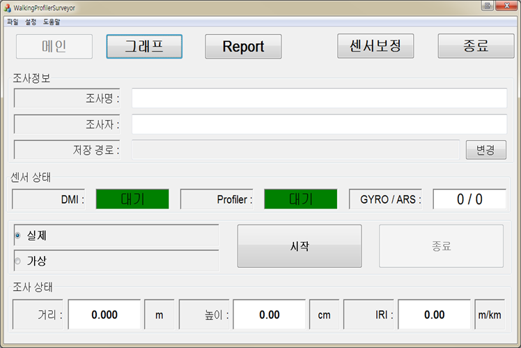  

* 그래프 출력화면

  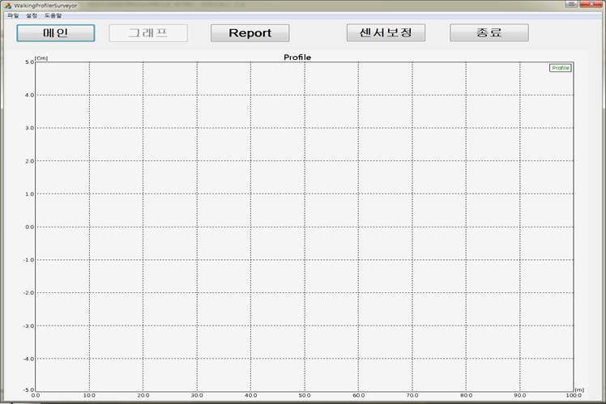  

## 종단평탄성 캘리브레이터

### 개요

로드텍에서는 노면 높이 측정용 하드웨어 모듈 내부에서 정확한 값 측정을 위해 적용할 보정 팩터를 산출하는 프로그램 유지보수 프로젝트였다.

기존 프로그램에서는 최적의 보정 팩터 값을 구하는 방식은  두 데이터의 차로 그려진 그래프가 얼마나 1차 직선에 근접하는지로 눈으로 보고 판단하였었다.

그러다 보니 사람마다 주관적일수밖에 없었고, 더욱이 팩터값을 구하기 위해서는 여러개의 파라메터를 수동으로 변경해가며 확인하는 방식이었기 때문에 시간도 오래걸렸다.

따라서 기존 방식에 비해 더 객관적이고 빠르게 구할 수 있게 해달라는 내부 요청에 의해 시작한 프로젝트였다.

### 세부내용

- 기간: 12.12.01 ~ 13.04.01
- 사용언어 : C++(MFC)
- 사용라이브러리 :  RTCore(사내 개발용 라이브러리), STL, GDI+

#### 담당파트

##### **UI 인터페이스 개선**

알고리즘 에 적용되는 파라메터 입력 인터페이스 레이아웃 및 기능을 구현하였다.

알고리즘 계산시 구간 설정을 할 수 있는 인터페이스 및 지정된 구간을 화면에 디스플레이 할 수 있는 기능을 구현하였다.

##### **보정 팩터 자동 산출 알고리즘 개발 및 적용** 

우선 취득된 원시데이터에 노이즈가 많아 바로 알고리즘을 적용할 수 없어 우선 이동평균 필터를 사용하여 튀는 값들을 제거하였다.

자체 개발한 알고리즘에서는 가속도 센서를 이중적분한 높이값과 레이저 센서의 값을 이용하여 사용하고 있었다. 

따라서 가속도 센서 데이터 값들은 추세선을 생성하여 x축 진행방향과 수평이 되도록 회전변환 시켰다.

이를 통해 레이저 센서의 데이터와 진행방향이 동일해짐에 따라 두 데이터 차의 합평균을 통해 유사도를 구할수 있었다.

최적 보정 팩터 산출은 내부에서 자동으로 파라메터 값을 변경해가면서 적용된 알고리즘을 통해 나온 유사도가 가장 큰값이 나올 때까지로 하였다.

### 어려웠던 점

#### **개발 역량에 한계에 따른 제한적인 기능 구현**

해당 프로젝트에서 수행했던 업무중 UI 구현이 가장 어려웠었다.

해당 프로젝트 수행 당시 MFC 프레임워크 상에서 리소스 뷰를 사용하여 레이아웃 수정을 한다던가 Device Context를 이용한 화면 출력 등 기능 구현을 하기엔 개발 역량이 많이 부족했었기 때문이다.

그래서 프로젝트 킥오프시 계산구간을 프로그램 화면상의 그래프에서 마우스로 드래그하여 지정할 수 있는 인터페이스로 해달라는 요구사항이 있었지만 당시 개발 역량의 한계로 에디터 컨트롤로 입력하는 방식으로 우회하여 구현하였었다.

### 정리

내부 프로세스 구현 위주로 진행했었던 첫번째 프로젝트와 달리 리소스 뷰를 통한 어플리케이션 레이아웃 수정 같은 부분을 주로 했었기 때문에 UI 개발 경험을 많이 쌓을 수 있는 프로젝트였다.

### 스크린샷

* 자동 팩터 분석 실행전 화면

    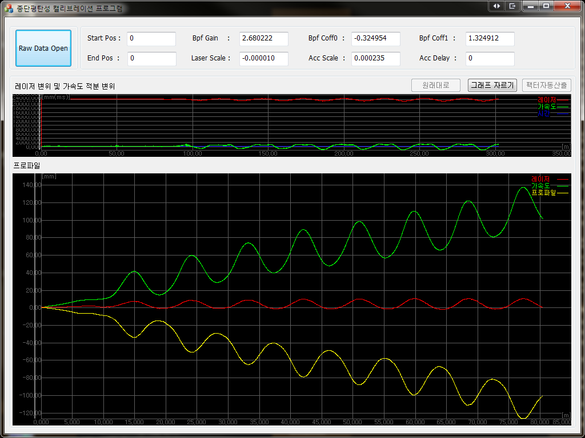  

* 자동 팩터 분석 실행 후 화면

  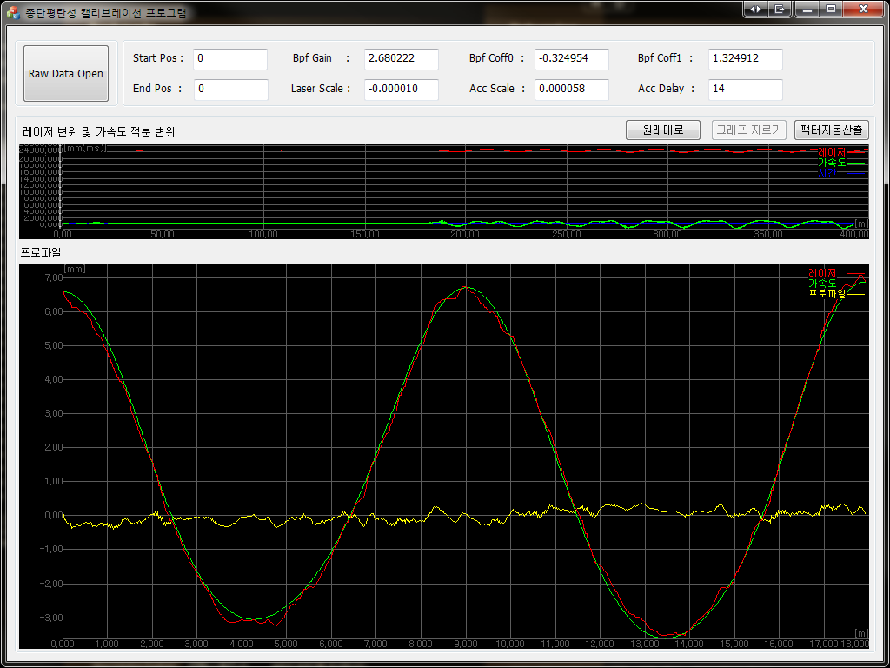  

## 고속소성변형 조사기

### 개요

로드텍 입사후 담당했던 첫번째 프로젝트로, 이전 프로젝트에서 개발한 어플리케이션 유지보수 프로젝트였다.

어플리케이션은 도로의 종방향 1m,  횡방향 3미터를 1mm 간격으로 취득한 노면 높이 데이터 파일을 로딩하여, 도로명 및 조사자명 같은 일반 정보와 노면 데이터 및 이를 기반으로 계산된 노면 물고임을 데이터 시각화를 통하여 보여주는 이미지 뷰어와 같은 프로그램이었다.

물고임 산출 알고리즘 개발 및 적용, 결과 보고서 파일 출력 기능 개발을 담당했었다

### 세부내용

* 기간: 2012.08,06 ~ 2012.12.28
* 사용언어 : C++(MFC)
* 사용라이브러리: RTCore(사내 개발용 라이브러리), STL

#### 담당파트

##### **물고임 산출 알고리즘 개발**

미분시 변곡점 구하면 해당 지점의 고/저 점 판별이 가능하다는 점을 이용하여 알고리즘을 개발하였다.

1. 횡방향으로 각 점들을 미분하여 해당 구간의 고점과 위치를  리스트에 저장
2. 좌우로 나눌 기준이 될 가장 높은 고점을 해당 리스트 찾음
3. 찾은 점을 기준으로 좌측부터 좌측에서 그 다음 높은 고점을 탐색
4. 두 점 사이에 속한 고점들은 전부 잠기므로 무시하고, 구간 사이의 물고임을 계산
5. 첫번째 고점에 도달할때까지 3-4번을 반복
6. 그 다음 우측에 대해서도 동일하게 반복하여 해당 구간의 횡방향 전체 물고임을 계산 
7. 각 구간의 횡방향 물고임 계산이 끝났으면 종방향에 대해서도 동일한 방식으로 계산

##### **물고임 산출 알고리즘 적용**

알고리즘 구현에는 STL의 Vector와 Tuple 자료형을 사용하였다.

고점 탐색은 std::find_if 같은 함수를 사용하면 쉽게 구할 수 있지만, 당시는 STL에 그런 함수가 있다는 것도 몰랐었기 때문에 for 루프를 이용한 순차 탐색으로 구했었다.

##### **결과 보고서 파일 출력 기능 개발**

화면상 보이는 조사명이나 조사자 같은 파일 정보와 설정한 간격 기준으로 계산된 면적, 부피 등의 분석 결과를 CSV 파일로 생성하는 기능을 개발하였다.

### 어려웠던 부분

#### **첫 개발, 첫 프로젝트**

프로젝트 투입 당시 C++ 은 대학교 교양수업 때 printf와 for을 이용한 간단한 코드 정도만 작성해 본 정도였다.

더욱이 사내에서 사용중인 개발툴인 Visual Studio나 MFC 프레임워크에 대한 사용경험은 전무했었다.

따라서 기능 코드가 어떻게 동작하는지 분석조차 할 수 없는 상황이었다.

다행히 팀 내 선임 개발자들로부터 개발툴 사용법이라던가 코드 분석 및 작성에 대하여 여러가지 도움을 받을 수 있었다.

개인적으로도 프로젝트 수행에 부족한 개발 역량을 채우는데도 게을리 하지 않았다. 퇴근 후나 주말 등 여가시간을 이용하여 C++ 및 MFC 개발 서적을 통해 역량 개발에 힘을 썼고,  첫 프로젝트를 무사히 성공적으로 마칠 수 있었다.

### 정리

작성일 기준(19.03.01)으로 보았을 때 개선할 부분이 많이 보였던 프로젝트가 때문에, 지금 생각하면 여러모로 많은 아쉬움이 남는다.

그 중에 가장 큰 두가지를 꼽아보자면 다음과 같다.

첫번째로 프로젝트 코드 구조 부분이다.

데이터 파일 입출력 및 데이터 분석 코드들이 전부 화면 출력 및 조작쪽 코드와 함께 구현되어 있어서 유지보수가 어려웠다는 점이다.

따라서 지금 이 프로젝트 유지보수를 맡았더라면, 모듈화를 위해 먼저 UI쪽 코드와 파일 처리 및 물고임 분석 쪽 기능 부분을 분리하는 작업부터 진행했을 것 같다.

두번째로 데이터 처리를 위한 속도 부분이다.

데이터 분석을 위해 횡방향, 종방향 순으로 계산시 단일 쓰레드를 사용하고 있었다.

예를 들어 20km 구간을 분석한다고 하면, 총 6천만개의 데이터를 횡방향 계산을 위해 3천개의 데이터를 2만번, 다시 종방향 분석을 위해 2만개의 데이터를 3천번 탐색해야했다.

따라서 구간 거리가 긴 데이터일 수록 분석 시간이 오래걸린다는 단점이 있었다. 

당시 쓰레드에 대한 개념 조차 없었기 때문에, 기존 개발자가 구현해놓은 프로세스에 개발한 알고리즘만 적용하여 구현했었다.

만약 지금이었다면, 각 구간의 횡방향 데이터는 서로 독립적이므로 종방향 10m 씩 나눠서 다수의 쓰레드를 사용하여 분석 시간을 좀 더 단축 시킬 수 있지 않았을까 하는 생각이 든다.

### 스크린샷

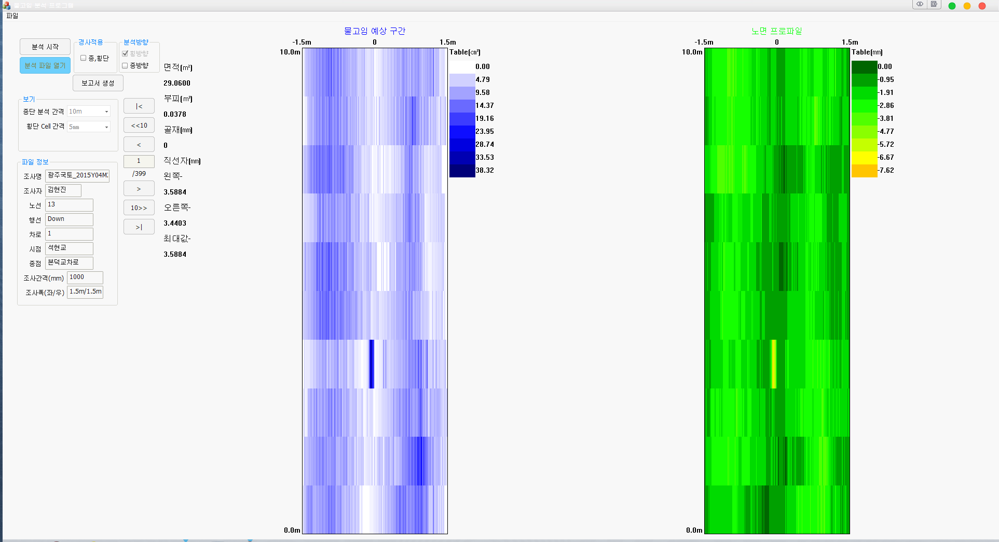  

