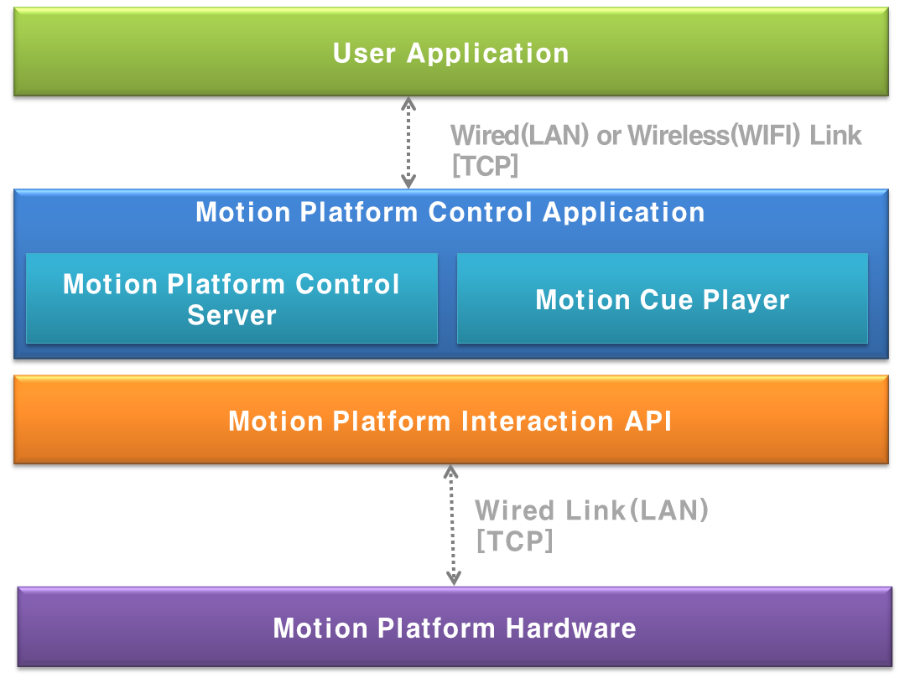
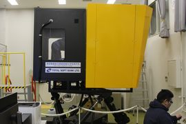
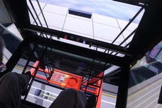
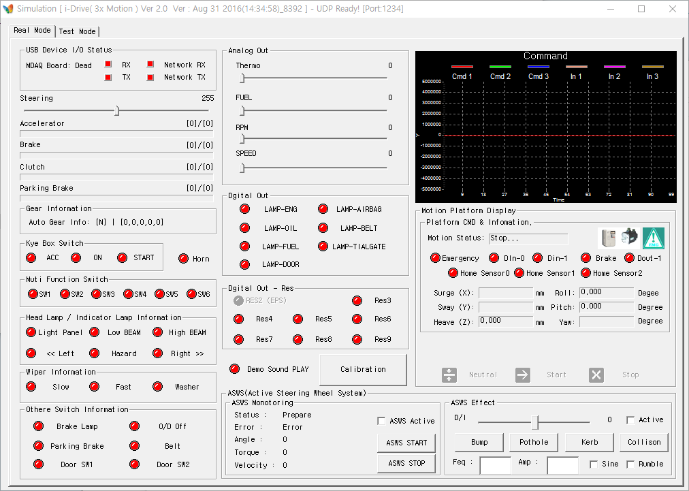
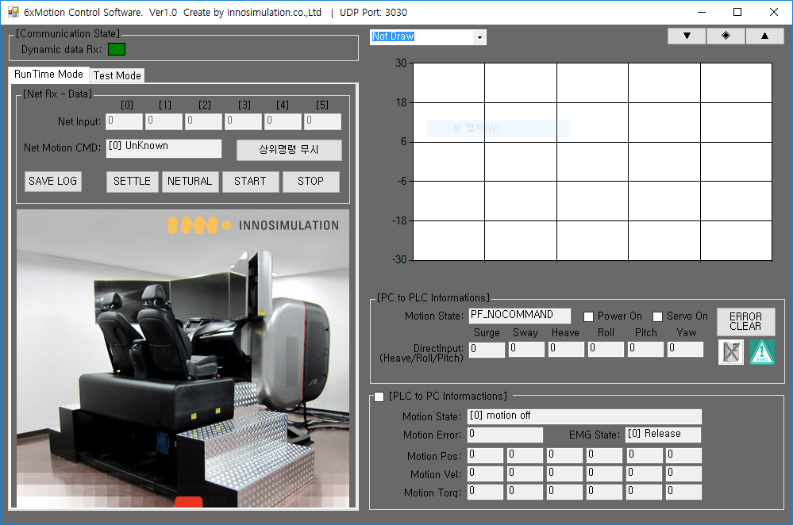

## VR 콘텐츠용 소형 모션 플랫폼(3축 ) 개발

### 개요

이노시뮬레이션에 입사하여 맡았던 첫번째 프로젝트로, 자사에서 개발한 VR 영상 컨텐츠 어플리케이션과  연동하여 동작하는 시트 타입 모션플랫폼(3축) 을 제어하는 어플리케이션 개발 프로젝트였다.

   

    

어플리케이션은 VR 컨텐츠 앱과 이더넷으로 연동할 수 있는 통신 부분, 모션플랫폼 상태 수신 및 동작 시키는 제어 부분, 큐(Cue) 에디터라는 프로그램에서 생성된 모션 데이터 파일을 로딩하고, 제어부분으로 데이터를 전달하는 큐(Cue) 플레이어 부분, 각 모듈의 상태를 모니터링하고, 사용자가 모션 데이터를 불러오거나, 모션플랫폼을 수동으로 제어할 수 있는 인터페이스를 제공하는  UI 부분으로 구성되어 있다. 

### 세부내용

* 기간 : 16.04.18 ~ 17.02.17
* 사용언어 : C++(MFC)
* 사용 라이브러리 : CoreBase(자체 제작한 이더넷 통신, 문자열 처리 라이브러리), STL(데이터 처리),PAIX Controller SDK(모션 플랫폼 제어),  MFC 기본 컨트롤 

### 담당파트

#### **VR 영상 컨텐츠 앱용 모션 플랫폼 제어 통신 프로토콜 설계**

프로토콜 구조는 이전 회사에서 쓰던 프로토콜을 참조하여 설계하였다. 이는 이미 여러환경에서 검증을 거친 프로토콜 구조로 바로 적용이 가능했기 때문이다.

프로토콜 설계 초기에는 VR 어플리케이션에서 시작, 중지를 비롯하여 모션데이터로 전달할 수 있는 방향으로 구조를 잡았었다.

그러나 VR 어플리케이션이 유선 환경에서 동작하는 바이브나 오큘러스가 아닌 기어 VR과 같이 무선으로 연결된 디바이스와도 연동할 수 있어야 한다는 요구 사항이 있었다. 따라서 무선환경에서는 아무래도 통신 상태가 유선보다 불안하기 때문에 시작, 중지 커맨드만 남기고 나머지 커맨드들은 전부 제외 시켰다.

#### **VR 컨텐츠 앱과 연동을 위한 통신 모듈 개발** 

VR 컨텐츠가 이더넷 타입으로 통신하는 방식이었기 때문에 프로그램도 이에 맞춰 동작하는 부분이 필요했다.

통신 부분은 신규 개발 대신 이전 회사에서 프로젝트 수행시 개발해놓은 모듈화된 코드를 활용하였다. 이미 이전에 여러 프로젝트에서 적용하여 사용중이라 안정성면에서도 검증은 되었음은 물론 개발기간도 단축시킬 수 있었기 때문이다. 

이를 활용하여 현재 어플리케이션에 필요한 부분인 컨텐츠 앱과 설계한 프로토콜로 송수신하는 데이터 처리 및 UI 연동 부분만 추가로 구현하는 방향으로 작업을 진행하였다.

#### **큐(Cue) 플레이어 모듈 개발** 

모션 데이터 파일을 로딩하여 제어 모듈에 전달할 수 있는 포멧으로 파싱하여 내부에 저장하였다가 VR 컨텐츠 앱으로부터 시작 커맨드 수신시 이에 맞춰 모션플랫폼을 동작시키는 데이터를 제어 모듈로 전달하는 모듈이다.

모션 데이터는 기존에 사내에서 사용중인 큐(Cue) 에디터라는 프로그램에서 생성된 텍스트 데이터 파일을 사용하였다.

#### **모션컨트롤러 제어 모듈 개발**

큐(Cue) 플레이어 모듈에서 전달받은 데이터로 실제로 모션플랫폼을 동작시키는 모듈이다.

모듈 구조 및 동작 프로세스는 이전에 개발했던 디바이스들과 유사했었기 때문에 당시 개발했었던 제어 모듈을 참조하여 설계, 구현하였다.

#### **UI 부분 개발**

어플리케이션이 컨텐츠 앱과 연동하여 안정적으로 실행되는 부분이 최우선이었다.

따라서 MFC 기본 컨트롤을 사용하여 UI 설계 및 구현은 최대한 공수가 들지 않는 방향으로 진행하였다.

### 어려웠던 점

#### **MFC 타이머의 성능 한계에 따른 어려움**

제어모듈에서 모션플랫폼을 동작시키기 위한 데이터 처리 부분 개발이 제일 어려웠었다.

VR 영상 컨텐츠와 모션플랫폼의 싱크가 최우선이었는데 기존의 MFC 타이머로는 해결할 수 없었기 때문이다.

특히 컨텐츠 길이가 길수록 싱크가 어긋나는 현상이 더 심했었다

타이머 간격을 늘리고, 데이터를 띄엄띄엄 전달하는 방법으로 싱크가 어긋나는 문제는 해결할 수 있었다. 

하지만 데이터 입력 간격이 늘어나다보니, 모션플랫폼이 부자연스럽게 움직여 탑승자가 영상 컨텐츠에 집중하지 못하는 문제가 발생하였다. 

해결 방안을 모색하던중, 구글 검색을 통해 멀티미디어 타이머를 사용하면,  타이머 최소 주기가 15ms인 MFC 타이머보다 더 짧게 설정하여 사용할 수 있다는 것을 알게 되었다.

해당 처리 부분을 멀티미디어 타이머를 사용하여 다시 구현한 결과, 모션플랫폼의 부자연스러운 움직임과 영상 컨텐츠와의 어긋났던 싱크. 두가지 문제를 한꺼번에 해결할 수 있었다.

### 정리

여느 프로젝트처럼 새로운 개발 기술을 적용하기보다는 이전 프로젝트들 통해 익혔던 개발 경험 및 네트워크 통신, 파일 입출력, 디바이스 제어 등 현재 보유한 기술들을 활용했던 프로젝트였다. 

이를 통해 현재 개발 기술들에 대한 수준을 파악하고, 개선할 부분을 확인할 수 있었기 때문에 개인적으로는 큰 의미가 있었던 프로젝트였다.

### 스크린샷

* 어플리케이션 실행화면

      

## 고베 항만대학 겐트리 교육 모션 플랫폼(3축,6축) 개발

### 개요

중장비용 가상훈련 유니티 어플리케이션 개발 회사인 소프트뱅크에서 발주한 프로젝트로, 트랙터 및 항만 컨테이너 하역시 사용하는 크레인인 겐트리 가상훈련용 어플리케이션과 연동하여 동작하는 모션 플랫폼 하드웨어 및 제어 어플리케이션을 제작, 납품하였다.

    

제어 어플리케이션은 유니티 어플리케이션이 구동되는 PC와는 다른 PC에 별개로 실행되었기 때문에 이더넷으로 연동하는 통신부분, 모션플랫폼의 상태데이터를 수신하고, 동작 시키는 제어부분, 모션플랫폼의 상태를 모니터링 하고, 사용자가 조작시킬 수 있는 UI 부분으로 구성되어 있다.

      

  

특이사항으로는 겐트리 가상훈련용 모션플랫폼 제어 어플리케이션의 경우 모션플랫폼에 좌우 흔들림이나 떨림 등의 효과를 발생시키는 스페셜 이펙트라는 모듈이 추가 되어 있다.

### 세부내용

* 기간 : 16.08.16 ~ 16.10.31
* 사용언어 : C++(MFC), C#(Winform)
* 사용라이브러리 : 미츠비시 모션 컨트롤러 SDK , 옴론 모션 컨트롤러 SDK, MFC & Winform 기본 컨트롤

### 담당파트

#### **모션플랫폼 제어 모듈 유지보수**

납품될 하드웨어가 이전에 이노시뮬레이션의 다른 프로젝트에서 제작된 적이 있었기 때문에 프로그램 역시 신규 개발을 하지 않고, 개발된 코드를 활용하는 방향으로 진행하였다.

트랙터와 겐트리용 제어 어플리케이션의 개발환경은 각각 MFC 프레임워크의 C++, Winform 프레임워크의 C#으로 각각 달랐다.

이는 겐트리용 모션플랫폼을 제어하는 하드웨어 컨트롤 제작사인 옴론에서 제공하는 SDK가 C#용 밖에 없었기 때문이다.

따라서 C++로 작성된 스페셜 이펙트 모듈과 연동을 위해 마샬링을 사용하였다.

#### **스페셜 이펙트 모듈 유지보수**

프로젝트 초기에는, 개발기간 단축을 위해 기존 개발된 개발 모듈을 활용하는 방안으로 진행하였다.

팀 내 알고리즘 개발직원이 이펙트 알고리즘 개발, 수정된 로직을 실제 구현하는 업무를 맞아 진행하였다.

문제는 기존 개발된 모듈이 헤더와 라이브러리 파일인 LIB와 DLL 외에 소스파일은 존재하지 않았다.

모듈 동작을 확인할 수 있는 기술 문서 혹은 샘플 프로그램이라도 없었기 때문에 신규 개발도 할 수 없는 상황이었다.

다행히 당시 해당 모듈을 개발했었던 전직원과 연락이 닿아 해당 소스를 받을 수 있었고, 무사히 개발을 완료할 수 있었다.

#### **트렉터용 모션플랫폼 제어 모듈 초기화 로직 개선**

트렉터용 모션플랫폼의 경우 상판을 받치는 각 축이 크랭크 타입으로, 장시간 사용시 상편의 수평이 맞지 않았다.

따라서 전원 인가시 상판 수평 및 구동 범위를 확인하기 위해 캘리브레이션 로직을 필수적으로 수행하게 되어 있었다.

기존의 경우, 상판의 수평이 맞지 않으면,  운용자가 상판에 수평자를 올려놓고,  프로그램을 조작하여  수평자가 수평이 될 때까지 각 축을 조정한다.

수평 위치는 크랭크와 크랭크 지지대 위치에 부착된 센서가 각각 마주볼 때 들어오는 LED 램프로 확인한다.

그 다음 위치값들에 적당한 마진을 두고, 초기화 루틴에 각 축을 시계/반시계 방향으로 돌리면서 각 축의 센서값이 마진을 둔 범위에 안에 들어오면 초기화 된 것으로 판정하였다.

문제는 상판이 수평상태임에도 불구하고, 일부 축의 센서값이 종종 마진을 둔 범위를 벗어나는 경우가 있다보니 초기화가 되지 않아 프로그램을 재실행해야했다.

이런 상황이 하드웨어와 연동하여 어플리케이션 기능 개발중 빈번히 발생하다보니 개발은 물론 디버깅도 원활하게 진행하기 어려웠다.

개선 방안을 검토한 결과, 기술 문서상에 센서들이 마주보았을 때 센서의 상태가 바뀌는데 것을 SDK의 API로 확인할 수 있다는 것을 알게 되었다.

그래서 마진 범위 확인 대신 센서 상태 확인 로직을 구현하여 적용 결과 기존 로직에서 발생했던 초기화 실패 현상은 더이상 발생하지 않았다.

#### **UI 부분 개발**

개발 협의시, 기존 개발된 어플리케이션 UI 구성을 그대로 유지하기로 했었기 때문에 사용편의성을 위해 UI 컨트롤 배치 같은 레이아웃 변경 작업정도만 진행하였다.

단 겐트리용 제어 어플리케이션의 경우 납품처에서 스페셜 이펙트 모듈 동작 테스트가 필요하다는 요청이 있어서 그 부분만 추가적으로 작업하였다.

### 어려웠던점

#### **C# 환경에서 C++ 코드 디버깅**

C# 언어로 개발/유지보수한 첫번째 프로젝트에 C++ 코드가 포함된 개발환경이었기 때문에 무엇보다도 디버깅이 제일 힘들었다.

특히 C# 개발 환경에서는 C++ 코드에 대하여 중단점 설정 등 비주얼 스튜디오에서 제공하는 디버깅 기능들을 사용할 수 없어서, 콘솔창을 띄우고 확인할 함수마다 printf로 값들을 출력해가며 디버깅을 했었다.

### 정리

기존 프로젝트 인계받아 코드를 분석하였을 때, UI나 내부 모듈등 여러가지 개선사항들을 발견할 수 있었다.

그러나 제작된 하드웨어가 협력업체 사정으로 인해 납품 2주전에서야 개발팀에 전달되었기 때문에, 모호한 함수나 변수명 변경 등 기본적인 부분 반영하고, 추가 기능 개발 및 검증에 집중할 수 밖에 없었던 것이 많이 아쉬움으로 남는다.

더불어 해당 프로젝트를 통해 산출물 관리에 대한 중요성을 다시 한번 몸소 체감했다. 

### 스크린샷

*  트랙터용 모션 플랫폼(3축) 어플리케이션 실행화면 

   

  

* 갠트리용 모션 플랫폼(6축) 어플리케이션 실행화면  

   

