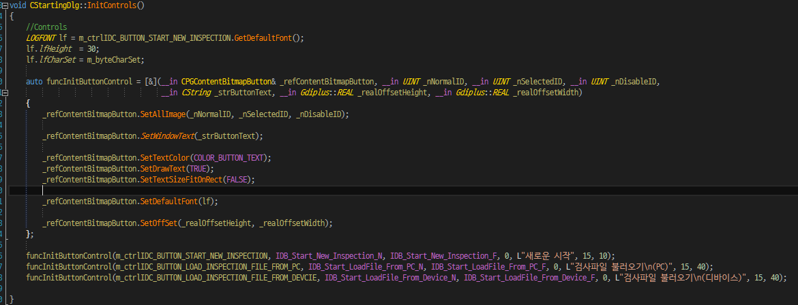

## innoeye Vision Manager For PC 어플리케이션 서브 컴퍼넌트 개발

### 개요

다수의 산업용 카메라와 연동하여 동작하는 PC 기반 머신 비전 시스템과 연동하는 서브 컴퍼넌트 개발 프로젝트였다.

시리얼 및 이더넷 기반 PLC(Programmable Logic Controller) 장치와 연동하여 동작하는 통신 모듈과 함께 AAEON社 Ultra Slim PC 내장형 디지털 입출력 보드 제어 모듈과 기존 고속 입출력 디지털 신호 처리 모듈과의 연동 부분을 맡아 개발 업무를 진행하였다.

또한, 메인 어플리케이션 상에서 신규 개발된 기존 메인 시스템과 연동을 위한 PLC 통신 모듈 설정 UI 개발도 함께 진행하였다.

### 세부내용

* 기간 : 2020.02.06 ~ 2020.03.27
* 개발 언어 : C++(MFC)
* 사용 라이브러리 : CoreBase(문자열 처리 라이브러리), CoreSerial(시리얼 통신 라이브러리), CoreEhternet(소켓 통신 라이브러리), AAEON HiSafe(AAEON PC 내장 디지털 입출력 장치 라이브러리), JsonCpp(설정파일 처리)

#### 담당 파트

##### 멀티 프로토콜 서포트 PLC 컨트롤 모듈 개발

PLC는 Programmable Logic Controller의 약자로 공장 자동화 라인에서 스마트 카메라나 감지 센서 등 다양한 기기들과 연동하여 제어 및 모니터링에 사용하는 제어 장치이다.

즉, 연결된 외부장치로부터 받은 입력을 프로그램에 의해 순차적으로 논리 처리하고 그 출력 결과를 이용해 다시 연결된 다른 외부장치를 제어한다.

특히 PLC 도입 이전 공장 자동화 라인에서는 PCB 기판에 릴레이 회로를 구성하여 구축하였는데, 생산 설비 상황에 따라 프로세스가 변경되는 경우 기판을 새로 제작하여 설치하는 등의 불편함이 있었다.

하지만 PLC는 이러한 프로세스를 프로그래밍하듯 코드를 작성하여 운용할 수 있어서 초기 셋업때와 상황이 달라질 때에도 유연하게 대처할 수 있다.

따라서 현재와 같이 복잡하고 대규모의 공장설비를 구축. 운영하는 데 있어 머신 비전 시스템과 함께 없어서는 안 될 구성이라고 볼 수 있다. 

그래서 이번 프로젝트에서 가장 비중을 두어 개발을 진행했던 부분이기도 하다.

이번 프로젝트에서 LS산전, 옴론 등 10여 개가 넘는 회사에서 취급하고 있는 PLC 중 실제 현장에서 가장 많이 쓰이고 있는 LS산전과 미츠비시를 대상으로 개발을 진행했으며, 제조사별로 선정했던 프로토콜은 다음과 같다.

  * LS산전 : XGT(Serial, Ethernet), ModbusTCP(Ethernet)
  * 미츠비시: MC(Ethernet) , NonProcdure(Serial) 

모듈 기획 단계에서 다양한 프로토콜의 동작 및 통신 인터페이스를 아우르면서, 외부와는 단일 모듈로 연동할 수 있도록 디자인 패턴 중 하나인 MVC 패턴을 사용하였다.

상기 그림은 개발했던 프로토콜 중 미츠비시社의 Ethernet MC 프로토콜로, 이름에서 알 수 있다시피 이더넷 기반으로 동작하는 프로토콜이다.

여기에서 실제 디바이스와 통신을 담당하는 컨트롤러에서 사용할 기반 데이터 모델인 DVI_PLC_Base_Packet에서는 공통을 사용할 기능과 구조를 정의하였고, 나머지 실제 PLC 프로토콜 데이터를 만들고, 파싱하는 부분은 DVI_PLC_Base_Packet을 상속받은 세부 구조체(여기서는 DVI_PLC_ETHERNET_MC_PACKET)에서 정의, 구현하였다.

컨트롤러 모델은 통신 인터페이스에 따라 시리얼 통신 클래스인 CoreSerialController를 부모 클래스로 둔 CPLCSerialController와 이더넷 통신 클래스인 CoreEthernetEvent를 부모 클래스로 둔 CPLCEthernet로 정의하였다.

다만 프로토콜별 공통 기능 및 로직을 CoreSerialController와 CoreEthernetEvent의 상위 클래스로 두는 건 설계에 맞지 않았기 때문에 이를 담당할 CPLCBaseController 클래스를 정의하여 상속받도록 설계하였다.

그 결과 CLSISSerialXGTController, CMitsubishiNonProcedureController 등 세부 컨트롤러 모델 클래스에는 프로토콜별 독립적으로 사용하는 기능들만 구현하도록 설계할 수 있었다.

이처럼 정의한 프로토콜 데이터 모델과 컨트롤러 모델 간의 의존성을 최소화하여 시리얼 통신환경에서 LS산전社의 이더넷 통신 프로토콜인 XGT Ethernet 데이터 모델과 미츠비시社의 EthernetMC 컨트롤러 모델처럼 동작하는 극단적인 컨트롤러를 정의하는 일도 가능해질 수 있었다.

따라서 정의된 프로토콜의 데이터 모델과 컨트롤러 모델 클래스 구조를 따라 구현만 하면 바로 메인 시스템과 연동하여 동작할 수 있도록 구성하였기 때문에 이후 프로토콜 추가 개발 시에도 신속하게 적용할 수 있게 되었다.

또한, 이번 프로젝트에서는 그동안 책을 통해서 글로만 익혔던 단위테스트를 적용하여 개발 업무를 수행하였다.

단위 테스트를 적용한 계기는 구현한 프로토콜별 데이터 모델이 문서에 기술된 데로 정상적으로 데이터 생성하고, 파싱하는지에 대한 확인이 필요했었는데, 실제 연동을 통해 검증하기에는 디바이스가 제 때 수급이 되지 않아 현실적으로 불가능했다.

따라서 프로토콜별 명세에 따라 생성된 더미 데이터를 단위테스트를 이용하여 개발을 진행하였고, 그 결과 정해진 일정에 큰 지연 없이 무사히 개발을 끝마칠 수 있었다.

##### AAEON社 Ultra Slim PC 내장형 디지털 입출력 보드 제어 모듈 개발

이번 프로젝트의 또 다른 목표 중 하나는 다양한 자동화 생산 설비에 활용할 수 있도록 현재 비전 시스템에서 지원하는 디지털 입출력 보드의 가짓수를 늘리는 것이었다.

이러한 목표를 기준으로 추가 보드 구입 없이 바로 디지털 입출력 기능을 활용 가능한 AAEON社의 Ultra Slim PC 내장형 디지털 입출력 보드를 선정하였다.

해당 모듈 개발 시 디바이스 제어 부분과 함께 메인 모듈인 고속 디지털 신호 입출력 모듈과 연동 부분은 이전 프로젝트의 EMUI 보드 제어 모듈에서 미리 구현해놓은 구조와 인터페이스를 참고하여 구현하였다.

또한, 이번 제어 모듈을 개발을 통해 기존 EMUI 보드 제어 모듈 개발 시 아쉬웠던 부분이었던 추가 모듈 지원을 고려하여 상위 클래스에서 공통으로 사용할 부분과 아닌 부분에 대한 구분을 보다 명확하게 정의할 수 있었다.

그 결과 처음 모듈 설계 시 놓쳤었던 부분을 보완할 수 있었기 때문에 보다 확장성을 고려한 유연한 모듈 구조를 가지도록 설계할 수 있었다.

### 어려웠던 점

#### 담당 분야에 대한 서포트 인력 부재로 인한 개발의 어려움

지금까지 수행해온 프로젝트들이 대부분 새로운 분야에 대해서 진행하는 경우가 많았는데, 해당 분야에 대해 개발할 때마다 제반 지식을 쌓고 이를 개발에 응용하는 것은 현실적으로 불가능하므로, 이를 보완해줄 전문 인력의 지원이 무엇보다 중요하다.

예를 들어 "이노시뮬레이션"에서 개발했었던 "모션 플랫폼 시트 제어 어플리케이션"의 경우, 모션 시트를 프로그래밍 적으로 제어하기 위해선 "역기구학"(Inverse Kinematics)" 알고리즘이 필요했었는데, 당시 이 부분은 제어계측공학"을 전공한 전문 인력이 담당하여 초기 기획 단계부터 개발, 검증까지 전 과정에 걸쳐 함께 수행했었기 때문에 프로젝트를 큰 일정 지연 없이 신속하고 성공적으로 끝낼 수 있었다.

하지만 이번 프로젝트에서는 내부 지원 없이 제조사의 공식 메뉴얼이나 구글 검색 및 관련 개발자 커뮤니티에 질문을 통해 혼자 개발, 검증을 진행해야 했기 때문에 많은 어려움이 있었다. 

### 정리

모듈 설계부터 구현, 검증까지 전반적인 개발업무를 지원 인력 없이 단독으로 담당하여 수행하다 보니 크고 작은 어려움은 있었지만, 그동안 책으로만 익혔었던 단위테스트를 실제 프로젝트에 적용해 볼 수 있었기 때문에 개인적으로는 큰 의미가 있었던 프로젝트였다.

## Innoeye Vision Manager For PC 어플리케이션 개발

### 개요

여러 대의 산업용 카메라에서 촬영된 이미지들을 기반으로 비전 검사를 수행하는 PC 기반 머신 비전 시스템 개발 프로젝트였다.

기존 자사 스마트 머신 비전 카메라의 하드웨어 성능 한계로 할 수 없었던 고해상도 영상 기반 고속 비전 검사 분야에 대응하기 위함이었다.

산업용 카메라(Area Scan 타입, Basler 社) 제어 모듈, 디지털 입출력 처리 보드(Innodisk社)를 이용한 고속 입출력 신호 처리 모듈, 머신 비전 시스템 아키텍처 등 어플리케이션 전반에 걸쳐 설계 및 개발 업무를 담당하였다.

또한, 어플리케이션 UI 개발도 담당하였었는데, 프로젝트 기간 단축을 위해 바로 이전 스마트 비전 카메라 어플리케이션 프로젝트의 관련 코드를 차용하였으며, 일부 UI는 당 프로젝트에 요구사항에 맞춰 다시 개발하였다. 

따라서 이전 프로젝트에서 일정상 이유로 진행하지 못했던 어플리케이션 UI 구조 개선 및 UI 컨트롤 개발 작업도 병행하여 수행하였다.

### 세부내용

* 기간 : 2019.01.07 ~ 2019.08.30
* 개발 언어 : C++(MFC)
* 사용 라이브러리 : CoreBase(문자열 처리 라이브러리), CoreCV(OpenCV 기반 이미지 프로세싱 라이브러리) STL, OpenCV, Pylon SDK(Basler 카메라), JsonCpp(설정파일 처리), GDI+, BCGControlBar, 기타 UI 오픈소스

#### 담당파트

##### JsonCpp 라이브러리를 이용한 모듈, 어플리케이션 환경 설정 파라메터 Json Serializer & Deserialer 모듈 개발

이전 프로젝트까지는 모듈 및 어플리케이션의 환경 설정 파라메터를 INI 파일로 저장하고 불러와서 적용하는 방식을 사용했었다.

그런데 해당 프로젝트에서는 모듈 및 어플리케이션의 환경 설정 파라메터 개수가 늘어나고, 단일 설정 파일로 관리가 되었음 하는 요구사항 때문에 복잡한 구조를 가지게 되면서 기존 방식으로는 처리할 수가 없었다.

따라서 여러 모듈의 파라메터를 한 파일에서 포함된 복잡한 구조를 다루는데 INI보다 JSON이 더 적합하다고 판단 JsonCpp 를 이용한 환경 설정 파일 모듈을 개발하였다.

이를 통해 상황에 따라 모듈별 환경 설정 파라메터를 하나의 파일 혹은 각각 파일로 저장하여 사용할 수 있게 됨으로써 상황에 따라 유연하게 설정 파일 정책을 가져갈 수 있게 되는 성과를 얻을 수 있었다.

##### 산업용 카메라 제어 모듈 설계 및 구현

Basler사의 산업용 카메라 SDK인 Pylon을 이용하여 개발하였으며, 모듈의 기본 구조는 SDK에 포함된 MFC 어플리케이션 예제를 참조하여 설계하였다.

GigE 표준 카메라 인터페이스를 지원하였기 때문에 추후 타사 GigE 카메라 연동을 고려하여 공통 인터페이스 부분에 대하여서 추상화 클래스를 고려하여 설계 및 구현하였다.

##### 고속 디지털 입출력 신호 처리 모듈 설계 및 구현

카메라와 외부 입출력 신호 처리를 수행하는 디지털 입출력 보드는 innodisk사의 디지털 IO 보드인 EMUI-0D01을 사용하였다. 

타사 제품보다 가격 측면의 부분에서의 경쟁력뿐만 아니라 최대 지원 입출력포트가 32개로 최대 4대의 카메라로 구성된 멀티 카메라 검사 환경에서 카메라별로 각각 4개의 입출력포트를 가져야 한다는 요구사항을 충족하는 유일한 제품이었기 때문이었다.

모듈 설계 시 스마트 카메라의 입출력 처리 모듈과 동일하게 동작해야 한다는 요구사항에 따라 입출력포트별 지연, 유지 시간 개념이 반영되었다.

또한, 이후 비용 혹은 또 다른 문제로 다른 하드웨어로 교체될 가능성도 고려하여 활성 포트에 대한 지연, 유지시간 처리 등 같은 응용 기능들은 상위 모듈 클래스에서, 포트 설정 및 활성화 같이 디바이스를 실제로 제어하는 부분은 하위 세부 클래스에서 동작하도록 구현하였다. 

##### 머신 비전 시스템 아키텍처 설계 및 구현

멀티 카메라 운용 방식은 이전 스마트 카메라 비전 시스템과 유사하였기 때문에 이를 참고하여 개발하였다.

다만 이전 스마트 카메라 비전 시스템과 다르게 UI 화면과 관련 있는 부분을 UI 쪽이 아닌 시스템 쪽에서 구현하였다는 점이다.

이를테면 화면에 있는 현재 연결 가능한 카메라들에 대한 정보를 담고 있는 그리드 리스트 컨트롤에 관련 정보를 디스플레이 하는 부분에 대해서 이전에서는 UI 구현 부에서 시스템 모듈에서 정보를 가져와 처리했다고 하면, 이번 프로젝트에서는 시스템 모듈에 컨트롤을 입력 인자로 받아 처리하도록 변경하였다.

그 결과 해당 화면뿐만 아니라 이와 유사한 화면 UI 구현 시 코드 작성량 또한 줄였을 뿐만 아니라 이후 컨셉 변경에 대한 코드 수정 또한 유연하게 대처할 수 있었다.

##### 어플리케이션 UI 화면 설계 및 구현

일부 어플리케이션 UI 화면은 해당 프로젝트의 요구사항과 맞지 않아 새로 설계 및 구현하였다.

이를테면 입출력 신호 설정 화면이 그 대표적인 예로 입출력 설정 인터페이스로 단일 스마트 카메라에 대하여 설정 가능했던 이전 프로젝트와 달리 여러 카메라를 설정할 수 있어야 했다.

따라서 이러한 요구사항이 반영된 화면에 맞는 커스텀 컨트롤을 새로 만들어 구현하였다.

요구사항을 고려한 화면 구성 및 동작 시나리오 검증을 위해 UI 와이어 프레임 툴인 `balsamiq` 을 활용하였다.

##### 커스텀 UI 컨트롤 내부 코드 개선

 이전 프로젝트의 어플리케이션에서 라운드 바 컨트롤이 포함된 화면에 해당 컨트롤에 안티 얼라이싱이 적용되지 않아 양 끝 부분이 거칠게 보이는 문제가 있었다.

 이번 프로젝트에서는 컨트롤 그리기 코드를 수정하여 양 끝단이 매끄럽게 보일 수 있도록 개선하였다.

  

##### 다국어 지원을 위한 커스텀 UI 컨트롤 구현

 이전 프로젝트에서 UI 코드 중 아쉬웠던 부분 중 하나가 텍스트와 이미지가 함께 있는 버튼 컨트롤의 다국어 처리였다. 

 기존 어플리케이션에 지원되는 언어인 한, 영, 중문 처리를 위해 각 버튼마다 언어별로 Normal, Focus, Disable 이미지가 각각 3개씩 총 9개가 필요했었다. 

 

 따라서 지원 언어가 추가되는 경우 버튼 이미지 제작은 물론 코드도 추가로 구현해야 하는 문제가 있었다. 

 따라서 언어별로 이미지상에서 공통으로 쓰는 부분만 남기고, 텍스트 출력 부분은 코드로 처리할 수 있도록 변경하였다.

 그 결과 버튼 컨트롤의 이미지 리소스 갯수는 1/3로 줄이고, 구현해야할 코드량도 줄이는 성과를 얻을 수 있었다.  

##### 멀티 타입 컨트롤 지원 가능한 커스텀 그리드 리스트 컨트롤 개발

 체크 박스, 콤보박스, 스핀 컨트롤 등 여러 타입의 컨트롤이 포함된 그리드 리스트 컨트롤을 개발하였다.

 상용 라이브러리인 BCGControlBar 에서 제공하는 그리드 컨트롤 기반으로 개발하였으며, 요구사항에 없는 기능들은 직접 구현하였다.

 이를테면 스핀 컨트롤이 포함한 에디트 컨트롤에서 에디트 박스에 입력한 값에 대한 범위 처리 부분이나 콤보박스 변경에 따른 그리드 리스트의 다른 컨트롤에 대한 유효성 체크 등 같은 부분이 그 대표적인 예라고 할 수 있겠다.

### 어려웠던 점

#### 설계 및 구현 난도가 높았던 고속 디지털 입출력 모듈

 프로젝트에서 맡았던 부분 중 입출력 모듈 설계 및 개발에 가장 많은 시간이 소요되었었다.

 그 이유는 PC 기반 머신 비전 시스템과 스마트 카메라 비전 시스템 간의 구조적 차이 때문이었다. 다시 말해 스마트 카메라의 입출력 모듈의 경우 해당 모듈과 카메라 제어, 비전 검사 모듈이 일 대 일로 연동하여 동작하는 구조였다.

 그런데 PC 기반의 머신 비전 시스템에서는 하나의 입출력 모듈이 다수의 카메라 제어, 비전 검사 모듈과 연동하여 동작하는 일 대 다 구조였기 때문에 모듈에서 고려해야 할 부분이 많았다.

 또한, 입출력 포트 처리에 대한 컨셉도 달랐다.

 이는 지원하는 입출력 포트 수도 차이 때문이었는데, 스마트 카메라의 경우 지원하는 입출력포트가 최대 다섯 개였기 때문에 해당 모듈에서 포트 개수만큼 스레드를 생성하고, 각 스레드 내부에서 Sleep 함수를 이용하여 지연과 유지 시간에 대한 동작을 구현하였었다.

 하지만 PC 기반의 비전 검사 시스템의 디지털 IO 보드는 최대 지원 가능한 입출력 포트가 32개로 스마트 카메라보다 6배나 많았다. 

 동일하게 구현할 경우 최대 32개의 스레드를 생성되는데 아무리 스마트 카메라보다 하드웨어적 성능이 뛰어난 PC 기반이라도 부담이 될 수밖에 없었다.

 또한, 카메라에서 촬영된 고해상도 이미지를 수신하고, 비전 검사를 위한 이미지 프로세싱 및 비전 검사 수행 등 여러 프로세스에 대한 동작도 고려해야 했기 때문에 스마트 카메라의 모듈 구조를 그대로 차용하는데 문제가 있었다.

 그래서 외부 신호가 감지된 입력포트와 검사 모듈과 연동하여 동작할 출력포트들같이 처리해야 할 포트들에 대하여 생성시간 정보를 추가하여 스레드에서 매 순간 발생한 입출력포트의 생성시간을 기준으로 경과시간을 계산하여 처리하도록 설계하였다.

 그 결과 처리할 입력, 출력 포트의 경과시간을 체크하여 처리하는 스레드 각각 하나. 외부 입력 신호에 대한 감지를 위해 폴링 타입으로 동작하는 스레드 하나. 총 3개의 스레드로 최대 32개의 스레드를 써야 했던 기존 스마트 카메라의 구조보다 더 적은 스레드로 같은 동작 하는 더욱 개선된 구조의 모듈을 개발할 수 있었다.

### 정리

 프로젝트 기간 단축을 위해 이전 프로젝트의 UI 코드를 차용함에 따라 UI 프레임워크 구조 및 코드 개선을 작업을 진행할 수 있었는데, 이를 통해 개선한 프레임 워크를 이전 프로젝트에도 적용하여 두 프로젝트의 코드 품질을 동시에 높일 수 있었다.

 더불어, 다소 난도가 있었던 고속 디지털 입출력 신호 처리 모듈 및 UI 커스텀 컨트롤 설계 및 개발을 통해 모듈은 물론 커스텀 UI 컨트롤 개발 역량 또한 향상 시킬 수 있었다.

## Innoeye Vision Manager 어플리케이션 개발

### 개요

 자사에서 개발한 1세대 머신 비전용 스마트 카메라(Innoeye) 하드웨어 성능 개선에 맞춰 기존 릴리즈 된 스마트 카메라용 어플리케이션을 리뉴얼하는 프로젝트였다.

 어플리케이션은 카메라 설정 및 촬영한 영상을 수신하는 제어 부분, 수신된 영상을 사용자 설정에 따라 검사 기준을 설정하는 비전 검사 부분, 화면에 영상을 출력하고, 사용자가 카메라 및 비전 검사 설정을 할 수 있도록 하는 UI 부분으로 크게 3부분으로 구성되어 있다.

 기존 어플리케이션에서 사용중 불편사항 및 개선사항 등을 반영하였으며, 사용자 편의성 및 심미성을 높이기 위해 UI 부분은 외주 전문 업체에 의뢰하여 진행하였다.

 그 외에 각 모듈(카메라 제어, 비전 검사) 개발, UI와 내부 모듈간 연동 작업은 내부에서 진행하였다.

### 세부내용

* 기간 : 2017.12.01 ~ 2018.12.31
* 개발 언어 : C++(MFC)
* 사용 라이브러리 : CoreBase(자체 제작한 이더넷 통신, 문자열 처리 라이브러리), STL, OpenCV, GDI+, CImage, GDI+, BCGControlBar, 기타 UI 오픈소스

#### 담당파트

##### 외주 개발한 UI 코드 리펙토링 및 사용성 개선

사내에 전문 UI 디자이너의 부재와 개발인원의 부족에 따라외주 전문업체에 의뢰하여 진행하였다. 

전달받은 산출물을 기본 구조를 제외한 나머지 부분에 대한 리펙토링 및 사용성 부분 개선 작업을 추가로 진행했었는데 그 이유는 다음과 같다.

###### 여러곳에 산재되어 구현된 동일한 코드들

 화면 내 배치된 컨트롤들의 리사이징 처리나 특정 키 입력에 따른 다이얼로그 종료(**MFC 다이얼로그 클래스는 Enter, ESC 키 입력시 포커스된 다이얼로그가 자동으로 종료된다**) 처리 무시 등 각 화면 클래스에서 공통적으로 동작하는 기능에 대한 코드들이 개별적으로 구현되어 있었다.

 그래서 수정 사항 발생시 각 화면 클래스 코드들에서 해당하는 부분을 찾아 일일히 수정해야 했기 때문에 유지보수에 어려움이 있었다. 

 따라서 각 화면에서 기본적으로 필요한 기능들을 정리하여, 공통 기능이 포함된 기반 클래스를 만들고, 이를 각 화면 클래스에서 상속받는 구조로 변경하였다.

 그 결과 기존에 비해 유지보수가 한결 편해졌음은 물론 각 화면 클래스에서는 세부적으로 필요한 기능만 구현함으로써 코드의 양 또한 줄일 수 있었다.

###### 배경 이미지에 전적으로 의존한 화면 구현

 사용자에게 현재 연결된 디바이스 정보를 리스트로 보여주는 화면이 있었는데, 리스트의 헤더에 표시될 세부 항목 텍스트 및 리스트의 레이아웃이 포함된 배경 이미지를 사용하여 구현되어 있었다.

 이로인해 특정 해상도(1920X1080) 이하에서나 리사이징시 화면의 내용을 확인하려면 스크롤을 하여 확인해야 하는 불편함이 있었다.

 

  

 그리고 화면에 출력되는 컨트롤의 배치를 리소스뷰가 아닌 코드상에서 구현되어 있어서 프로그램 실행전까지는 화면에 어떻게 보이는지 확인이 어려운 문제가 있었다.

 

 따라서 프로그램을 실행하지 않고도 각 화면의 배치를 확인할 수 있도록 리소스 뷰에서 모든 컨트롤들을 배치하고, 화면 내에서 구분되어 보여야 할 영역에 대해서는 분리하여 처리하였다. 

 

 

 또한 구현한 리사이징 기능을 적용하여 화면의 전체 컨트롤들이 화면 해상도에 상관없이 전부 디스플레이 되도록 하였다.

 

 

###### 직관성이 낮은 화면 UI

 일부 화면 UI의 경우 직관성이 떨어져 사용자에게 모호함을 주기도 했었는데, 그 대표적인 예가 카메라 연결 화면이다.

 해당 화면에서 연결된 디바이스 리스트 하단에 버튼을 클릭하면, 편집모드로 변경되어, 사용자가 디바이스 삭제나 아이피 어드레스 변경할 수 있도록 구현되어 있었다.

  하지만 기존 화면의 경우 편집모드에서 변경 가능한 항목과 아닌 것이 외관상으로는 전혀 구분되지 않았기 때문에, 처음 화면을 접했을 때 혼란스럽다는 피드백이 많았었다.

 

 

 이에 개선한 화면에서는 편집모드로 전환시 변경가능한 항목의 배경색을 달리 표현되도록 함으로써 사용자 직관성을 높였다.

 

 

##### 카메라 제어 모듈 신규 개발

기존 구현된 카메라 제어 모듈이 있었지만, 두가지 이유로 인해 새로 개발을 진행했었다.

첫번째, 불필요한 코드로 인해 코드의 가독성이 너무 떨어져 동작 분석이 어려웠었다. 예를 들면, 카메라 제어를 커맨드 송신 데이터가 대략 40종류가 넘는데, 이에 대한 응답 처리부분을 하나의 함수에서 함수포인터와 Swich문으로 처리하다보니 확인하고자 하는 특정 커맨드에 대한 응답 데이터가 어떻게 되는지 확인이 어려운 문제가 있었다. 또한 초기 개발시부터 모듈화 없이 UI 프로젝트에 직접 구현하다보니 UI및 비전 검사 처리 부분과 연동하는 코드도 섞여 있어 코드 분석을 더더욱 어렵게 만들었었다.

두번째, 연결중 접속이 수시로 끊기거나, 프로그램 실행중 크래시가 발생하는 등 안정성 문제가 있었다. 새로이 개발을 하려 했었기 때문에 원인 파악을 위해 자세한 분석은 진행하지 않았으나, 첫번째 이유에서 언급한 문제로 인해 발생했던 것으로 판단된다.

### 어려웠던 점

#### 외주 관리 업체와의 소통의 어려움

 프로젝트 일정을 맞추기 위해 UI 디자인 및 개발 부분을 외주로 진행했었는데, 이것이 오히려 프로젝트를 지연시키는 요인이 되었다. 

 예를 들면, UI 외주 개발자가 사무실에 상주하여 근무하지 않았기 때문에, 개발관련한 논의시 전화나 이메일로 하다보니 소통의 어려움이 있었다. 얼굴을 보고 이야기를 하면 한시간도 안걸릴 내용들이 하루가 넘게 오고가는 경우가 예사였다.

 특히 내부에서 개발중인 일부 모듈은 UI와 연동해서 검증이 가능했는데,외주에서 코드 전달이 늦어지면, 연동, 검증도 연쇄적으로 지연되다보니, 계획햇던 일정보다 더 늦어지는 경우도 있었다.

### 정리

 그동안 주로 MFC 기본 컨트롤을 이용하여 UI를 개발해왔었기 때문에 프로젝트 수행전 가장 부족하다고 생각했던 부분이 UI쪽 개발이었다. 

 그런데 외주개발 의뢰한 UI 코드 산출물이 요구사항대로 나오지 않아 어쩔 수 없이 해당 부분을 맡게 되면서, 내부 코드 분석을 통해 UI 화면 및 여러 컨트롤 개발을 할 수 밖에 없었다. 많은 경험이 없던 부분이라, 개발하는 내내 어려움은 많았었다., 그렇게 한번 겪고나니, 웬만한 UI 개발은 가능할 것 같은 자신감이 생겼다.

 하지만 그렇게 한번 하고 나니 어지간한 UI 디자인은 구현할 수 있을 것 같은 자신감이 생겼고, 이 때 익혔던 스킬들은 다음에 기술할 펌웨어 업데이터 프로젝트 수행시 유용하게 쓰였다.

### 스크린샷

* 커스텀 프로세스 컨트롤바 데모

    

* 프로그램 실행화면(초점조정 안내)

  

* 프로그램 실행화면2(검사파일 관리)    

* 프로그램 실행화면3(실시간검사)

      

## Innoeye Firmware Updator 어플리케이션 개발

### 개요

자사 스마트 카메라(이하 Innoeye)에 펌웨어를 업로드 할 수 있는 어플리케이션을 개발하는 사이드 프로젝트였다.   

이미 동일한 기능을 하는 어플리케이션이 존재했었으나, 단순히 Innoeye와 연결해서 펌웨어만 업로드 할 수 있는 기능 제공했었기 때문에, 현재 연결된 디바이스나 , 업로드할 펌웨어 파일의 정보 등을 확인할 수 없어 불편한 점이 있었다. 

또한 업로드 중 프로그램이 다운되는 현상이 종종 발생하여 안정성 문제도 있었기 때무에 이러한 부분을 수정 및 개선하기 위함이 목적이었다.

어플리케이션은 카메라와 연결, 제어 및 파일 업로드를 하는 부분과 연결된 카메라의 정보를 출력 및 사용자가 업로드할 카메라 연결하고 펌웨어를 선택할 수 있는 UI 부분으로 나눠지는데, 두 파트 전부 담당하여 진행하였다.

특이 사항으로는 이전 Innoeye Vision Manager 프로젝트에서 개발한 제어 및 UI 부분 기술 들을 재활용하여 개발 기간을 단축시켰다는 점이다.

### 세부내용

* 기간 : 2018.07.02 ~ 2018.07.20
* 개발 언어 : C++(MFC)
* 사용라이브러리 : innoeye Vision Manager 프로젝트시 개발 제어 모듈, MFC 기본 컨트롤 및 UI 오픈 라이브러리 소스

#### 담당파트

##### **UI 설계 및 개발**

 UI 설계시 사용자가 업로드할 디바이스와 펌웨어의 정보를 한눈에 볼 수 있었으면 좋겠다는 요구사항이 있었다.

이에 요구사항을 최대한 반영하기 위해  가장 부합되는 디자인을 구글링을 통해  다양한 어플리케이션 디자인 리서치 하여  'Samsung Magician'(삼성 SSD 파티션 어플리케이션)을 디자인 레퍼런스로 선정 하였다.

    

개발 전, UI 목업 제작 어플리케이션 툴인 'Balsamiq'을 사용하여, 레이아웃 및 동작 시나리오를 검증하였다.

  

UI 화면 개발시 기존 어플리케이션과 디자인적으로 차별화를 주기 위해 MFC 기본 컨트롤을 사용하는 대신 Innoeye Vision Manager 프로젝트 UI 개발 코드를 일부 활용하였다.

##### UI와 제어 모듈간 연동

Innoeye Vision Manager 프로젝트시 이미 연동 작업을 수행한 경험이 있었고, 해당 어플리케이션 비하면 사용자 조작에 따른 UI상 처리해야 할 부분들이 적었기 때문에 작업을 진행하는데 크게 문제가 없었다.

### 어려웠던 점

#### MFC 프레임워크상 디자인한 UI 구현 한계

inno-eye Vision Manager 프로젝트에서도 겪었던 문제이긴 한데, MFC 프레임워크상의 한계인지는 몰라도 프로그램 화면에 보이는 UI와 디자인 툴로 작성한 것과의 차이를 줄이는 부분이 많이 어려웠었다.

이를테면 다이얼로그 배경으로 각 꼭지점에 R이 들어간 사각형 출력시, R값을 아무리 크게 주어도, 디자인 툴에서 보이는 것만큼 꼭지점 부분이 스무스한 사각형을 만들기 어려웠다. 구글 검색을 통해서 찾은 방법(사각형을 먼저 그리고, 각 꼭지점에 맞는 작은 원을 그리는 식)도 적용해보았으나, 기존 방식과 별로 차이가 없었다.

UI의 디테일한 부분도 이번 프로젝트에서 중요한 부분으로 생각했었다. 

하지만 전체적인 어플리케이션 개발에서 봤을 때는 중요도가 낮은 부분으로 무작정 시간을 쏟을 수도 없는 상황이었기 때문에 가능한 범위 내에서 최대한 유사하게 보일수 있도록 구현하는 선에서 마무리를 지었다.

### 정리

이전 프로젝트를 수행하며 익혔던 기술을 다음 프로젝트에서 활용함으로써 해당 스킬에 대한 전문성을 업그레이드할 수 있었다.

### 스크린샷

* 펌웨어 업로드 프로세스 화면

    

* 디바이스 및 펌웨어 정보 출력화면

    

## Innoeye Code Manager 어플리케이션 개발

### 개요

동일비전 입사후 처음 맡았던 프로젝트로, Zebra사의 바코드 하드웨어 모듈(이하 PL3307)이 탑재된 자사 바코드 리더기와 연동하는 어플리케이션 개발을 맡았었다.

어플리케이션은 바코드 리더기와 연결하고, 동작 환경 설정 및 스캔한 영상 및 데이터를 수신하는 제어 모듈과 수신한 영상 및 데이터를 출력하고, 사용자가 리더기 동작을 설정할 수 있도록 조작하는 UI 부분으로 나눠지며, 두 파트를 전부 담당하여 진행하였다.

### 세부내용

* 기간 :  2017.03.13 ~ 2018.02.09

* 사용언어 : C++(MFC)
* 사용 라이브러리 : STL, GDI+, OpenCV, BCGControlBar

#### 담당파트

##### **UI 설계, 구현 및 제어 모듈 연동 작업**

이전까지 UI 구현은 전부 대화상자 기반에서 작업했었는데, 해당 프로젝트에서는 SDI 기반에서 설계 및 구현을 진행하였다. 

SDI 구조를 채택한 이유는 두가지로, 첫번째는 UI 디자인 레퍼런스였던 Zebra 사 바코드 리더기 어플리케이션인 "123Scanner"의 UI가 SDI 구조였기 때문이었고, 두번째는 새로운 UI 기반에서 개발해보고자 하는 개인적인 욕심이었다.

    

UI 개발시 유료 UI 라이브러리인 BCGSoft사의 BCGControlBar를 사용했다. SDI 기반 개발에 참고할만한 풍부한 샘플 코드와 메뉴 디자인을 위한 UI 설계 프로그램이 제공되었기 때문이었다.

    

100 여개가 넘는 설정 파라메터를 손쉽게 처리 하기 위해 데이터 포멧은 XML,데이터 입출력에는 tinyXML 라이브러리를 사용하였다. 

XML보다 데이터 구조를 명확하게 보이는 JSON을 택하지 않은 이유는 이전 프로젝트에서 어플리케이션 설정 파라메터를 tinyXML 라이브러리로 XML 포멧으로 처리하는 모듈을 개발한 적이 있었다. 따라서 추가 공수 없이 빠르게 해당 프로젝트에 적용 가능 했기 때문이었다. 

파라메터 화면 출력은 Property Grid 컨트롤을 사용하여 구현하였는데, 다른 컨트롤에 비해 다수의 데이터를 손쉽게 입출력이 가능하고, 스핀컨트롤, 콤보박스 등 여러 종류의 컨트롤들을 파라메터의 입력타입에 따라 능동적으로 처리하고 하나의 컨트롤 안에 포함시킬 수 있었기 때문이었다.

##### **PL3307 제어 모듈 개발** 

PL3307에서 USB, Serial 두가지 통신모드를 지원하였기 때문에, USB는 Zebra사의 SDK를 사용하여 구현하였으며, Serial의 경우는 마찬가지로 Zebra사의 독자적 Serial 프로토콜인 SSI(Simple Serial Interface)를 기반으로 구현하였다. 

Serial 통신쪽의 경우 통신부분은 이전 프로젝트에서 만들었었던 통신 모듈을 활용하여 개발 기간을 단축하였다. 또한 기능 확장을 위해 PL3307과 연동하여 동작하는 자체 개발한 펌웨어 탑재로, 펌웨어 통신 프토토콜 설계 업무도 같이 수행하였다.

USB 와 Serial 제어 모듈의 인터페이스가 대부분 동일하였기 때문에, 공통 인터페이스를 가지는 기본 클래스 설계한 뒤에 해당 클래스를 상속하여 각 모듈별 세부 기능을 구현하였다. 이를 통해 UI 부문과 단일 클래스로만 연동하도록 구현함에 따라 사용자가 어플리케이션 상에서 어떤 통신 모드의 바코드 리더기를 연결하여도 유연하게 처리할 수 있었다.

### 어려웠던 점

#### **낯선 분야에 대한 개발의 어려움**

그동안 프로젝트를 수행하면서 처음 접해보는 분야였던 경우에라도, 내부에 해당 분야에 대한 경험자가 최소 한명 이상은 있었기 때문에 업무 수행에 크게 어려움이 없었다.

그러나 해당 프로젝트의 경우 내부에 바코드 리더기를 다뤄본 경험자가 전무했었기 때문에 제조사가 제공해준 기술문서에 의존하여 디바이스의 동작을 분석하고, 연동하는 어플리케이션을 개발 했어야만 했다. 

그런데 문서도 원서인데다가 바코드와 관련한 전문용어가 많이 나와 관련 배경지식이 전무했던 당시로서는 개발에 앞서 전반적인 내용 파악하는데 어려움이 많았다.

### 정리

UI 라이브러리 사용 및 SDI 기반 UI 어플리케이션 개발을 통해 UI 개발 스킬을 강화할 수 있었다.

동일한 동작을 하는 다른 통신 모드에 대한 효과적으로 처리하기 위한 설계 및 구현 경험을 통하여 어플리케이션 구조 설계 및 개발 스킬을 강화할 수 있었다.

### 스크린샷

* 멀티 바코드 스캔 설정

    

* ROI 영역 설정 및 영상출력

      

* 바코드 영상 출력 및 스캔환경 설정

      

* 설정 파라미터(XML) 프로퍼티 리스트 컨트롤 출력

    
